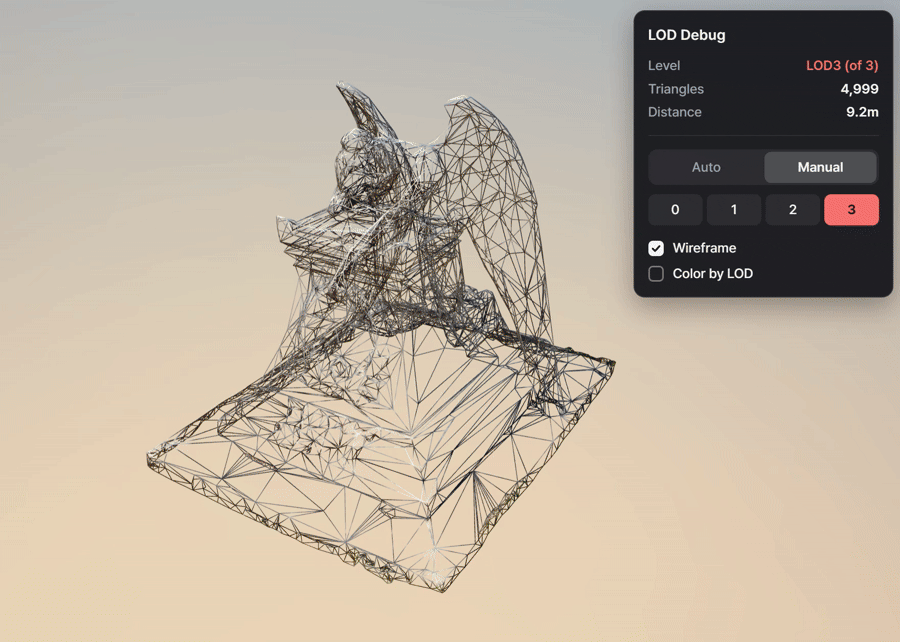

# playcanvas-runtime-lod

Runtime LOD (Level of Detail) scripts for PlayCanvas.
At startup, the scripts simplify your meshes with [meshoptimizer](https://github.com/zeux/meshoptimizer) to
generate LOD levels automatically, then switch between them based on camera distance.
There is no build step: just upload the files to the PlayCanvas Editor.

No pre-authored LOD models are needed. Any indexed mesh in a render component gets automatic
mesh decimation (polygon reduction) when the app starts, which cuts the triangle count of distant
objects in WebGL scenes.

**[▶ Live demo](https://playcanv.as/p/06c52602/)** — switch to **Manual**, pick a level (0–3), and turn on
**Wireframe** or **Color by LOD** to watch the triangle count change.

<a href="https://playcanv.as/p/06c52602/"></a>

<sub>Model in the demo and recording: ["Frank"](https://sketchfab.com/3d-models/frank-0eb1f1757349489eab05a0f03cff5b46) by [misterdevious](https://sketchfab.com/misterdevious), [CC BY-NC-SA 4.0](https://creativecommons.org/licenses/by-nc-sa/4.0/). The recording is shared under the same license.</sub>

| File | Script name | Purpose |
|------|-------------|---------|
| `lod.js` | `lodScript` | LOD generation + camera-distance switching |
| `lod-debug-ui.js` | `lodDebugUI` | (Optional) on-screen debug panel |
| `meshopt-simplifier.js` | – | meshoptimizer simplifier (global `MeshoptSimplifier`, third-party code) |

## Setup

1. Upload all three files to the Editor.
2. In **Settings > Scripts Loading Order**, place `meshopt-simplifier.js` before `lod.js`.
3. Add `lodScript` to any entity with a render component. Add `lodDebugUI` too if you want the debug panel.

## Attributes (`lodScript`)

| Attribute | Description | Default |
|-----------|-------------|---------|
| LOD Levels | Number of LOD levels to generate (1-4) | 3 |
| LOD1–4 Distance | Distance at which each LOD level kicks in | 10 / 25 / 50 / 100 |
| LOD1–4 Ratio | Fraction of the original triangles kept | 0.5 / 0.25 / 0.1 / 0.05 |
| Target Error | Maximum simplification error, relative to mesh size | 0.01 |
| Auto Generate | Generate LODs on initialize | true |
| Camera | Camera used for distance (first camera in the scene if empty) | – |
| Debug | Log LOD info to the console | false |

## Scripting API

```js
const lod = entity.script.lodScript;

lod.setManualMode(true);     // disable automatic distance-based switching
lod.setLODLevel(2);          // force LOD2
lod.getCurrentLOD();         // current level
lod.getCurrentTriangleCount();
lod.getCameraDistance();

lod.generate().then(() => { /* generate manually when Auto Generate is off */ });
```

## Debug panel (`lodDebugUI`)

Shows the current LOD level, triangle count and camera distance on screen.
In Manual mode you can pick a level with the number buttons. You can also toggle wireframe
rendering and per-level color tinting.
The panel sits in the top-right corner on desktop and moves to the bottom center, with larger
touch targets, on phones in portrait orientation.

## How it works

- Vertex buffers are left untouched. Only a separate index buffer is built per level, and
  `mesh.indexBuffer[0]` is swapped at runtime.
- When the script is removed (`destroy` event), the original index buffer is restored and the
  generated buffers are freed.
- Because meshes are modified in place, entities that share the same render asset also share the
  active LOD level.

## Credits

### meshoptimizer — MIT License

Mesh simplification is powered by [meshoptimizer](https://github.com/zeux/meshoptimizer)
by **Arseny Kapoulkine** (npm package v1.0.1).
`meshopt-simplifier.js` is a copy of meshoptimizer's `js/meshopt_simplifier.js`. The only change is
the removal of the final `export` line so it loads as a classic PlayCanvas script; the original
copyright header is kept in the file.
See [THIRD_PARTY_NOTICES.md](THIRD_PARTY_NOTICES.md) for the full license text.

### "Frank" 3D model — CC BY-NC-SA 4.0

The following model was used in the PlayCanvas project where these scripts were developed and tested.
The model file is **not** included in this repository; only the demo recording
`docs/lod-switching-demo.gif` and `docs/social-preview.png`, which show it, are. Both are shared under CC BY-NC-SA 4.0.

> ["Frank"](https://sketchfab.com/3d-models/frank-0eb1f1757349489eab05a0f03cff5b46)
> by [misterdevious](https://sketchfab.com/misterdevious)
> is licensed under [CC BY-NC-SA 4.0](https://creativecommons.org/licenses/by-nc-sa/4.0/).

This license requires crediting the author, allows non-commercial use only, and requires
modified versions to be shared under the same license.

## License

The scripts (`lod.js`, `lod-debug-ui.js`) and documentation are released under the [MIT License](LICENSE).

Third-party parts keep their own licenses, listed in [THIRD_PARTY_NOTICES.md](THIRD_PARTY_NOTICES.md):

- `meshopt-simplifier.js`: meshoptimizer by Arseny Kapoulkine, MIT License.
- `docs/lod-switching-demo.gif`, `docs/social-preview.png`: show the "Frank" model by misterdevious, CC BY-NC-SA 4.0 (non-commercial).
